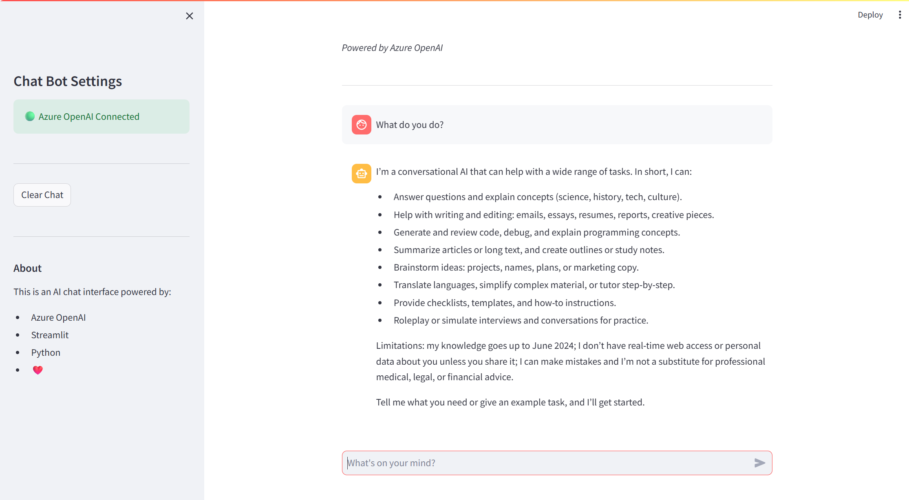

# AI Chat Assistant

A modern AI-powered chat interface built with Python, Streamlit, and Azure OpenAI.

## Screenshots



*The clean, modern interface showing the AI chat assistant in action with Azure OpenAI integration*

### Key UI Elements:
- **🟢 Connection Status**: Green indicator showing successful Azure OpenAI connection
- **💬 Chat Interface**: Clean message bubbles for user and AI responses  
- **🎯 Sidebar Controls**: Clear chat button and application information
- **⚡ Input Field**: "What's on your mind?" prompt for user queries
- **🤖 AI Responses**: Intelligent responses powered by Azure OpenAI

## Features

- 🤖 **AI-Powered Responses** - Integrated with Azure OpenAI for intelligent conversations
- 💬 **Clean Chat Interface** - Modern, responsive design with message bubbles
- 📝 **Conversation History** - Maintains context throughout the chat session
- 🔒 **Secure Configuration** - Environment-based API key management
- ⚡ **Real-time Responses** - Fast, streaming-like experience with loading indicators
- 🎨 **Customizable UI** - Easy to modify styling and branding

## Prerequisites

- Python 3.8 or higher
- Azure OpenAI resource with deployed model
- Git (for cloning the repository)

## Quick Setup

1. **Clone the repository:**
```bash
git clone https://github.com/shubhasismathur/chat-ui.git
cd chat-ui
```

2. **Create a virtual environment:**
```bash
python -m venv venv
# On Windows:
venv\Scripts\activate
# On macOS/Linux:
source venv/bin/activate
```

3. **Install dependencies:**
```bash
pip install -r requirements.txt
```

4. **Configure Azure OpenAI:**
```bash
# Copy the example environment file
cp .env.example .env
# Edit .env with your Azure OpenAI credentials
```

5. **Set up your `.env` file with your Azure OpenAI credentials:**
```env
AZURE_OPENAI_ENDPOINT=https://your-resource.openai.azure.com/
AZURE_OPENAI_API_KEY=your_api_key_here
AZURE_OPENAI_API_VERSION=2025-01-01-preview
AZURE_OPENAI_DEPLOYMENT_NAME=gpt-4
```

6. **Run the application:**
```bash
streamlit run src/main.py
```

7. **Open your browser and navigate to:** `http://localhost:8501`

## Configuration Options

### Environment Variables

| Variable | Description | Example |
|----------|-------------|---------|
| `AZURE_OPENAI_ENDPOINT` | Your Azure OpenAI endpoint URL | `https://your-resource.openai.azure.com/` |
| `AZURE_OPENAI_API_KEY` | Your Azure OpenAI API key | `abc123...` |
| `AZURE_OPENAI_API_VERSION` | API version to use | `2025-01-01-preview` |
| `AZURE_OPENAI_DEPLOYMENT_NAME` | Your model deployment name | `gpt-4` or `gpt-35-turbo` |

### Supported Models

This application has been tested with:
- GPT-4 (recommended)
- GPT-3.5-turbo
- GPT-4o-mini

**Note:** Some models like `gpt-5-mini` may have parameter restrictions. The application automatically adjusts for model compatibility.

## Project Structure

```
chat-ui/
├── src/
│   ├── main.py                 # Main Streamlit application
│   ├── utils.py               # Utility functions for session management
│   └── azure_openai_service.py # Azure OpenAI integration service
├── requirements.txt           # Python dependencies
├── .env.example              # Example environment configuration
├── .gitignore               # Git ignore rules
└── README.md               # This file
```

## Usage

1. **Start a conversation** by typing in the chat input at the bottom
2. **View responses** from the AI assistant powered by Azure OpenAI
3. **Continue the conversation** - the app maintains context throughout the session
4. **Clear chat history** using the sidebar button
5. **Monitor connection status** via the sidebar indicator

## Troubleshooting

### Common Issues

**"Azure OpenAI Not Connected" in sidebar:**
- Check your `.env` file configuration
- Verify your Azure OpenAI endpoint and API key
- Ensure your deployment name matches exactly

**API Parameter Errors:**
- Some newer models have parameter restrictions
- The app automatically adjusts for most models
- Check Azure OpenAI documentation for your specific model

**Installation Issues:**
- Ensure Python 3.8+ is installed
- Try upgrading pip: `python -m pip install --upgrade pip`
- Use a fresh virtual environment if dependency conflicts occur

### Getting Help

- Check the [Azure OpenAI documentation](https://docs.microsoft.com/en-us/azure/cognitive-services/openai/)
- Review the application logs in the terminal
- Open an issue on GitHub if you encounter bugs

## Contributing

1. Fork the repository
2. Create your feature branch
3. Commit your changes
4. Push to the branch
5. Create a new Pull Request

## License

MIT